IDE Setup
============

First, download and install openJDK8, this step varies according to your operating system. 
For Windows: http://jdk.java.net/8/
For Linux: http://openjdk.java.net/install/
Then, download, extract and run Eclipse Mars Eclipse IDE for Java Developers https://www.eclipse.org/mars/ 
Choose any folder as your workspace.

 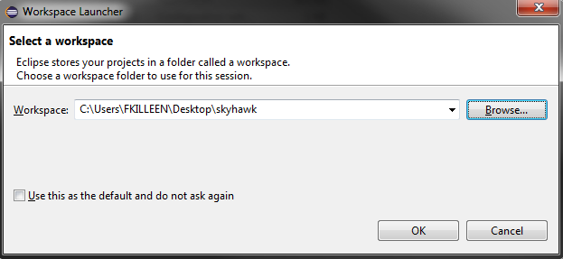

Make sure the jdk1.8.0 is selected. If it does not show up, you can use the search option and point to the Java installation path. (On Windows this is usually under C:\Program Files\Java)

 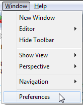

 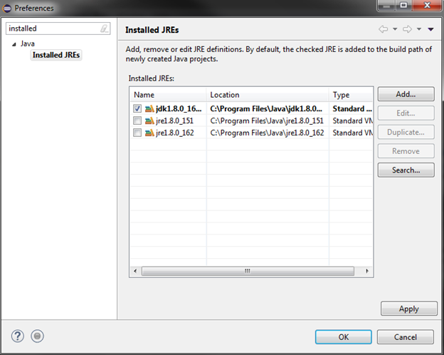 

In order to setup our development environment, we need to install a plugin called **Remote System Explorer**. This plugin can be installed via the **Install New Software** option of the **Help** menu.

 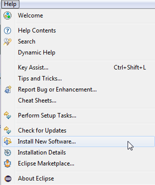

  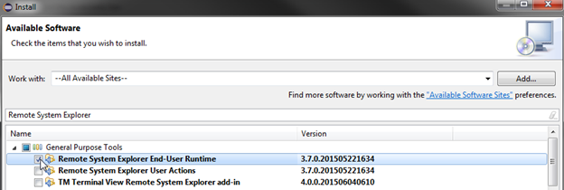

Next, we need to download the JSCH plugin (jsch-xx.jar) and place it in the following directory:

eclipse\plugins\org.apache.ant_1.9.6.v201510161327\lib

<https://sourceforge.net/projects/jsch/>

This plugin will be used to deploy the Java bytecode to the target.

 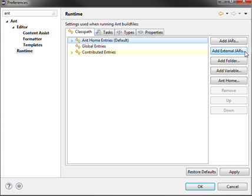

 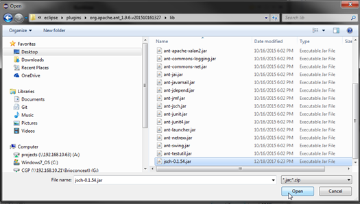

We can now start to setup our project. First, let’s import a Maven project via **File->New->Other->Maven Project** option. Create a simple project (skip archetype selection). Follow the setup as indicated in the figure 14 to 16.

 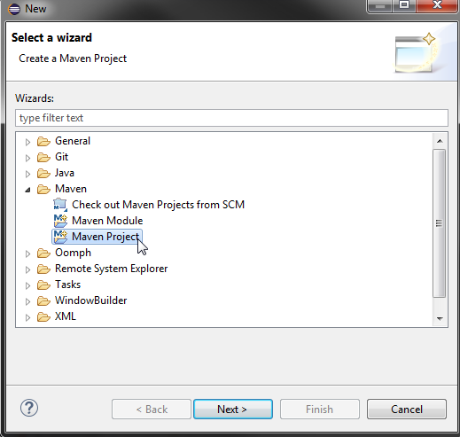

 

 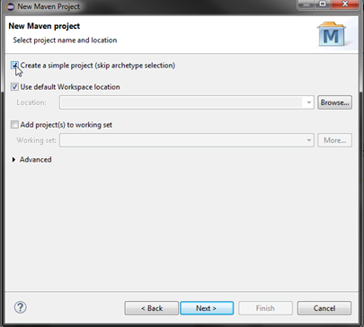

 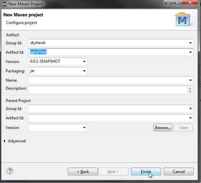

At this point you need to copy the provided **pom.xlm remoteDebug.xml** and **all .java** files to the workspace as shown in the figure 17. 

Switch to the Java perspective

 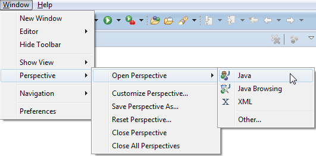

Also, make sure the JRE System Library is jdk1.8.0. If this is not the case you can set it by doing right click on the project->Properties->Workspace default JRE (jdk1.8.0) Press F5 to refresh the project if the files do not show up. 

You might have to manually create the “skyhawk” directory under src/main/java

 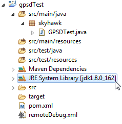

We can now package everything. Run Maven Install to download the project dependencies and to package the example into a .jar

  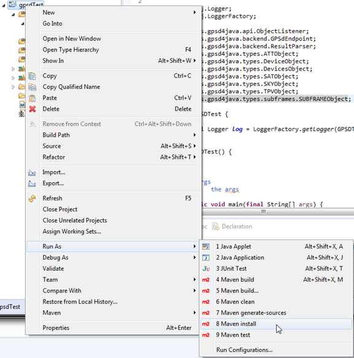

**For remote debugging only :**

We are almost ready to test the program on the target. First, we need to tell eclipse to use the remote debug Ant task. Double click on **Ant Build** to create the remote debug task.

 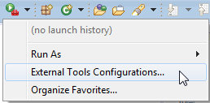

  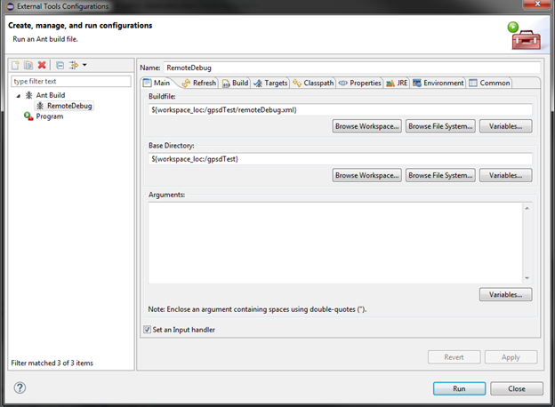

Run the remote deploy and debug ant task.
 This will install the application on the target and execute it in remote debugging mode.

 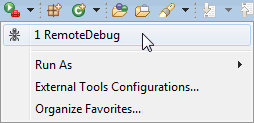

If successful, the console should show the following results.

 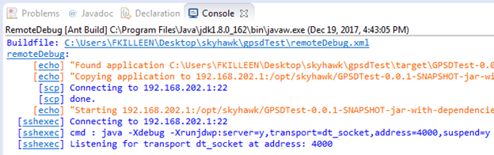

 

Now all that is left to do is start the debugger. Make sure you specify the IP address of the device and the port 4000.

 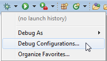

 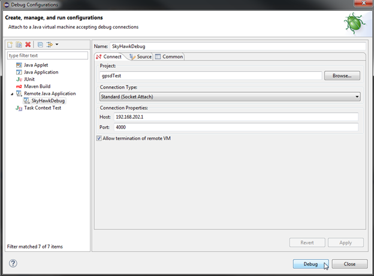

We can also use the remote system explorer to send commands to the target or visualize processes and the filesystem.

 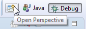

 

 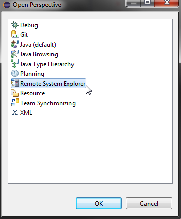

To do so, we need to setup a connection to the device. Choose **SSH Only**.

 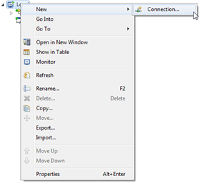

 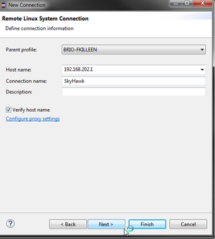

At this point you can launch a Shell that will be connected to the target via SSH.

 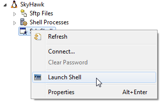

Enter the credentials
 user: **root** 
 password: **temp**

 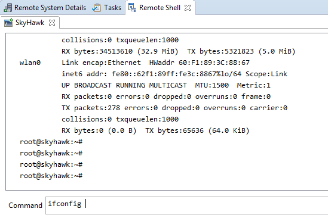

Here is a view of the target filesystem and as we can see the .jar has been deployed to the **/opt/skyhawk** folder.

 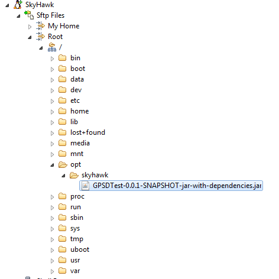

------------------------

### The pom.xml

Watch out for the pom.xml file, it contains the configuration for the project and dictates the dependencies and tells maven how to build the project (what method to use as main, how to package the project, etc.)

For projects use Grpc and protobuf, the pom file should be the same or very similar between projects, here is an example file with comments around the parts you should edit for your projects :

~~~~xml
<project xmlns="http://maven.apache.org/POM/4.0.0" xmlns:xsi="http://www.w3.org/2001/XMLSchema-instance"
	xsi:schemaLocation="http://maven.apache.org/POM/4.0.0 http://maven.apache.org/xsd/maven-4.0.0.xsd">
	<modelVersion>4.0.0</modelVersion>
	<groupId>grpc</groupId>
	<artifactId>blink-demo</artifactId>   <!-- Your project name -->
	<version>0.0.1-SNAPSHOT</version>     <!-- Your version -->
	<dependencies>
		<dependency>
			<groupId>io.grpc</groupId>
			<artifactId>grpc-netty</artifactId>
			<version>1.8.0</version>
		</dependency>
		<dependency>
			<groupId>io.grpc</groupId>
			<artifactId>grpc-protobuf</artifactId>
			<version>1.8.0</version>
		</dependency>
		<dependency>
			<groupId>io.grpc</groupId>
			<artifactId>grpc-stub</artifactId>
			<version>1.8.0</version>
		</dependency>
	</dependencies>
    <build>
		<extensions>
			<extension>
				<groupId>kr.motd.maven</groupId>
				<artifactId>os-maven-plugin</artifactId>
				<version>1.5.0.Final</version>
			</extension>
		</extensions>
		<plugins>
			<plugin>
				<groupId>org.xolstice.maven.plugins</groupId>
				<artifactId>protobuf-maven-plugin</artifactId>
				<version>0.5.0</version>
				<configuration>
					<protocArtifact>com.google.protobuf:protoc:3.5.0:exe:${os.detected.classifier}</protocArtifact>
					<pluginId>grpc-java</pluginId>
					<pluginArtifact>io.grpc:protoc-gen-grpc-java:1.8.0:exe:${os.detected.classifier}</pluginArtifact>
				</configuration>
				<executions>
					<execution>
						<goals>
							<goal>compile</goal>
							<goal>compile-custom</goal>
						</goals>
					</execution>
				</executions>
			</plugin>
             <plugin>
				<artifactId>maven-assembly-plugin</artifactId>
                 <!-- Make one execution per .jar you want (in our example project we do one .jar per example, your project might need only one) -->
				<executions>
	      			<execution>
	        			<id>SkyHawkPowerManager-make-jar-with-dependencies</id> <!-- Your .jar id -->
	        			<phase>package</phase>
	        			<configuration>
					      <archive>
						    <manifest>
							  <mainClass>blinkDemo.BLink_SkyHawkPowerManager_example</mainClass>  <!-- Your main method (package.ClassContainingMain) -->
						    </manifest>
					      </archive>
					      <descriptorRefs>
						    <descriptorRef>jar-with-dependencies</descriptorRef>
					      </descriptorRefs>
					      <finalName>BLink_SkyHawkPowerManager_example.jar</finalName> <!-- Your .jar name -->
				        </configuration>
	        			<goals>
	          				<goal>single</goal>
	        			</goals>
	      			</execution>
	    		</executions>
			</plugin>
		</plugins>
	</build>
</project>
~~~~

